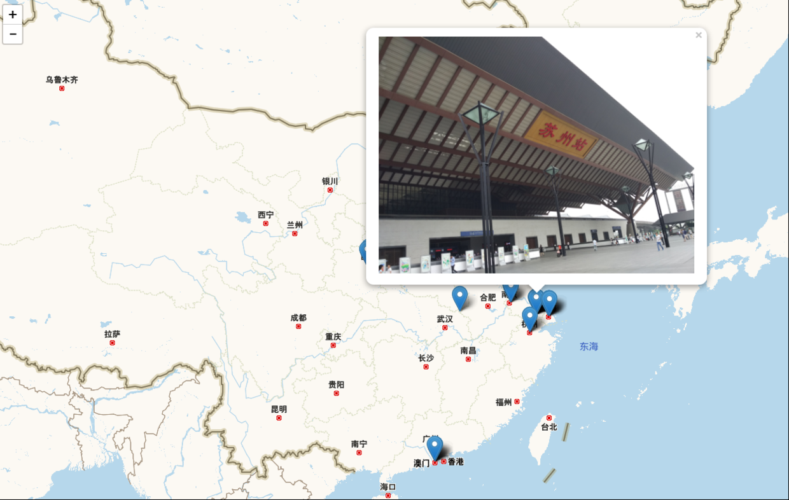
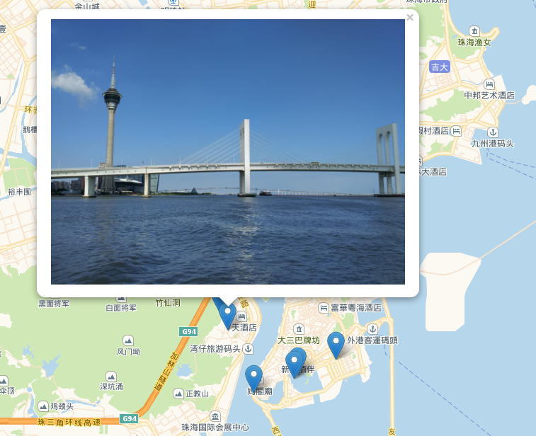

### 去过的风景
> 上传你的照片，程序根据照片里的地理位置信息将代表照片的标签放到地图上的相应位置并展示，（还可以有日期时间信息），**直观全面地展示你去过的风景，带来新的回忆感受**。
- 安装依赖(即工具第一行)后使用run.bat运行，在localhost:8000查看。

### 初步效果
- 
- 

### 进一步
- 添加聚合效果，显示照片密集程度
- 可以增加时间轴
- 增加新的动态展示形式

#### 工具
django + django-restframework + PIL (pip install) + 
sqlite3 (自带) + 
leaflet + 高德地图 (cdn) + 
vuejs + vue-resource (cdn)